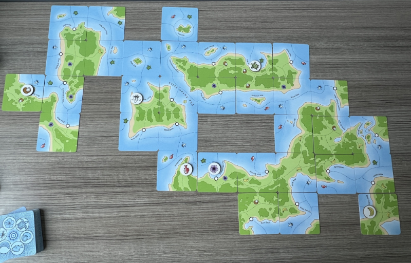
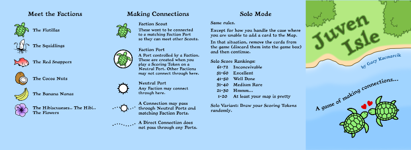
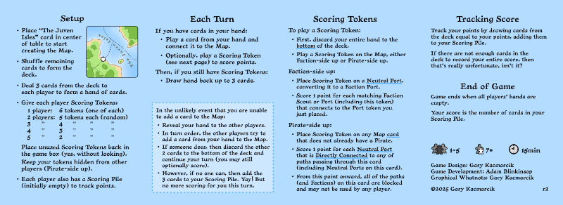

# Juven Isle

Juven Isle is a tile-laying (actually card-laying) game where you create a map of islands – building connections and deciding when to play your scoring tokens to maximize your score.

When you score, you draw cards from the deck into your score pile. The total number of points available is limited by the cards remaining in the deck, so if you wait too long your opponents will have claimed them all.

